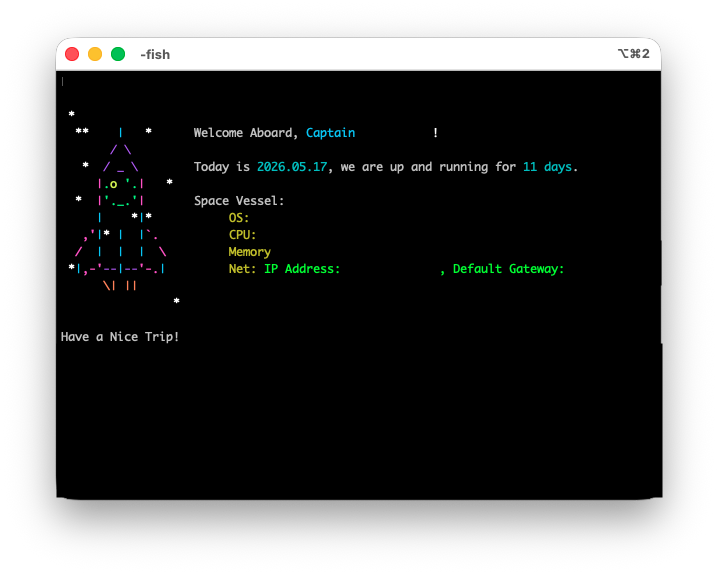
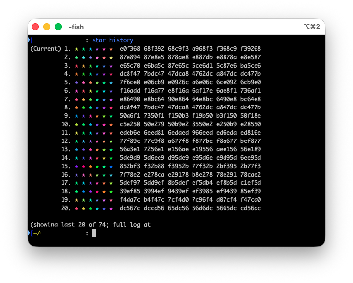
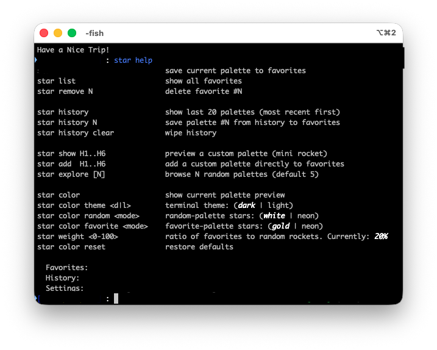
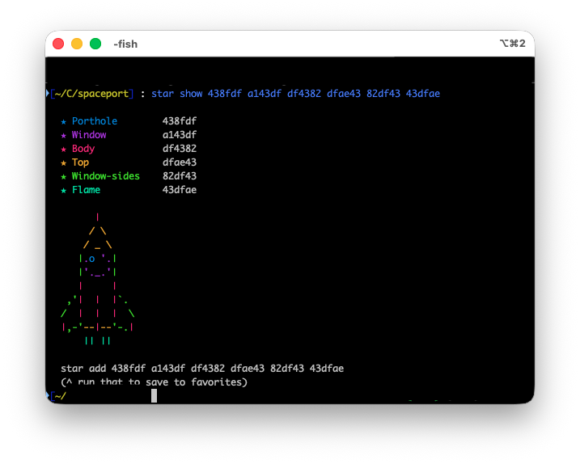

# 🚀 starcommand

*Created By [Peter Azmy](https://github.com/clefspear)*

starcommand launches a different rocket every time you open a shell — a bash, zsh, PowerShell, and fish greeting that turns every new terminal into a unique generative artifact. Each rocket's colors, stars, and flame are mathematically linked — change the palette, and the entire constellation changes with it.



-----

## How many rockets are possible?

A lot.

- **~2 × 10⁴³ unique rockets possible** — every palette deterministically reproducible from its six hex codes
- **148 candidate star cells** around the rocket
- **18 stars per rocket**, deterministically placed from the palette's bytes
- **8 flame patterns**, mapped from the first palette byte
- **28-color neon mode** that re-rolls every star color independently
- **6 color roles** (porthole, window, body, top, window-sides, flame), each drawn from a full 24-bit color space

Every shell you open rolls a fresh palette from a high-entropy seed, so two identical rockets appearing twice in a lifetime is statistically impossible. Every tab is — visually — the first time anyone has ever seen that exact rocket.

But the kicker: it's all reproducible. Save a palette to favorites and you've saved the *entire visual identity*. Same six hex codes always produce the same 18 stars in the same 18 positions with the same flame. The palette is the spec.



*Every row is a rocket that actually rolled up in a normal week of opening tabs. Each palette deterministic from its six hex codes.*

-----

## The `star` command

`star help` displays the current value of every setting inline, in **bold italics**, so you can see the active state at a glance.



### Save and explore

|                  |                                           |
|------------------|-------------------------------------------|
|`star`            |Save the current palette to favorites      |
|`star list`       |Show all favorites                         |
|`star remove N`   |Delete favorite `#N`                       |
|`star history`    |Last 20 palettes (most recent first)       |
|`star history N`  |Save palette `#N` from history to favorites|
|`star show H1..H6`|Preview a custom palette as a mini rocket  |
|`star add H1..H6` |Add a custom palette to favorites          |
|`star explore [N]`|Browse `N` random palettes (default 5)     |

*`star show` previews any 6 hex codes as a full rocket before saving — useful for vibe-checking a palette you found.*

*With per-launch randomization, `star history` is the easiest way to rescue a rocket you liked: it appeared a few tabs ago, scroll back, find its number, save it.*



<!--  -->

### Settings

|                                 |                                                 |
|---------------------------------|-------------------------------------------------|
|`star color`                     |Show current palette + rocket preview            |
|`star color theme <dark\|light>`  |Match your terminal background                   |
|`star color random <white\|neon>` |Star color on random rockets                     |
|`star color favorite <gold\|neon>`|Star color on favorite rockets                   |
|`star color reset`               |Restore defaults                                 |
|`star weight <0-100>`            |Ratio of favorites to random rockets (default 20)|

Light-mode terminal? Run this once so stars stay readable:

```sh
star color theme light
```

-----

## Cross-shell reproducibility

starcommand uses a portable xorshift32 PRNG, implemented identically in bash, zsh, PowerShell, and fish. The seeding is independent per launch (every new shell rolls its own seed from `/dev/urandom`, or `Get-Random` on Windows), so each tab gets a fresh rocket — but if you feed the *same* seed to any of the four implementations, you get byte-identical output.

That matters because the palette is the spec. Save a palette to favorites in bash, sync `rocket_favorites.txt` to another machine running PowerShell, and that same six-hex-code line produces the same 18 stars in the same 18 positions with the same flame. Favorites are portable across every supported shell.

Verified by `tests/parity_test.sh`, which runs all four shells against a fixed reference fixture and confirms zero bytes of difference.

<!--  -->

-----

## Install

Requires bash ≥ 3.2 (macOS default), zsh ≥ 5.0, PowerShell ≥ 5.1, or fish ≥ 3.0.

**bash:**

```bash
curl -fsSL https://raw.githubusercontent.com/clefspear/starcommand/main/bash/install.sh | bash
```

Open a new tab. Done. On macOS, the installer writes to both `~/.bashrc` and `~/.bash_profile` so login shells pick it up.

**zsh:**

```zsh
curl -fsSL https://raw.githubusercontent.com/clefspear/starcommand/main/zsh/zsh_greeting.zsh | zsh
```

Open a new tab. Done.

**fish:**

```fish
mkdir -p ~/.config/fish/functions
curl -fSL -o ~/.config/fish/functions/fish_greeting.fish \
  https://raw.githubusercontent.com/clefspear/starcommand/main/fish/fish_greeting.fish
```

Open a new tab. Done.

**PowerShell:**

```powershell
iwr -useb https://raw.githubusercontent.com/clefspear/starcommand/main/powershell/install.ps1 | iex
```

Open a new tab. Done.

> Windows users: if you hit *"running scripts is disabled on this system"*, run this once and then re-run the installer:
>
> ```powershell
> Set-ExecutionPolicy -Scope CurrentUser -ExecutionPolicy RemoteSigned
> ```

The `-fSL` flags on curl matter: `-f` makes curl fail on HTTP errors instead of writing the error body to disk, `-S` shows the error message, and `-L` follows redirects. Without `-f`, a typo'd URL silently saves "404: Not Found" as your shell greeting and you'll see `command not found: 404:` on every new tab until you fix it.

-----

## Color modes

**Gold (default for favorites)** — when a saved favorite rolls up, the star field renders in bright Mario-star yellow. Instant "oh, that one's mine" recognition.

<!--  -->

**Neon** — every star independently rolls from a 28-color palette spanning the full hue wheel at 15° increments. Maximum chromatic chaos.

<!--  -->

Use neon on favorites to make them pop, or on random rolls to make every shell feel like a party.

-----

## The math

**Palette → rocket** (the visual layer):
Each palette hex code splits into 3 bytes (R, G, B), giving 18 bytes per rocket. Those bytes index into a precomputed list of 148 candidate cells around the rocket. Each byte contributes two stars (`byte % 148` and `(byte + 73) % 148`, deduplicated). The flame is simpler: `bytes[0] % 8` picks from 8 ASCII patterns. Reproducible from the palette alone — same six hex codes, same constellation, every time.

**Seed → palette** (the cross-shell layer):
A xorshift32 PRNG, implemented identically across all four shells, generates the palette from a seed. The PRNG state is a single 32-bit unsigned integer, advanced with the standard `x ^= x << 13; x ^= x >> 17; x ^= x << 5` step, with `& 0xFFFFFFFF` masking on shells that use signed 64-bit integers (bash, zsh). HSL-to-hex color conversion uses awk on Unix shells and PowerShell's native math, both producing identical hex output.

**Seed sourcing:**
Every shell launch reads a fresh 32-bit unsigned integer from `/dev/urandom` on bash, zsh, and fish, and from `Get-Random` on PowerShell. Zero is rejected (xorshift32 sticks at zero) and re-rolled. This means every tab is a new rocket, but if you explicitly pass the same seed to any of the four implementations, you get byte-identical output — which is what makes favorites portable across shells.

Verified by `tests/parity_test.sh` and `tests/prng_reference.txt` — every shell reproduces the reference fixture exactly when given the same seed, and the end-to-end test confirms byte-identical output across bash, zsh, PowerShell, and fish.

-----

## Files

```
~/.config/bash/
├── starcommand.sh                  # the theme (bash)
├── rocket_favorites.txt            # saved palettes (plain text)*
├── rocket_history.txt              # last 100 launches*
└── rocket_settings.sh              # theme, modes, weight

~/.config/zsh/
├── zsh_greeting.zsh                # the theme (zsh)
├── rocket_favorites.txt            # saved palettes (plain text)*
├── rocket_history.txt              # last 100 launches*
└── rocket_settings.zsh             # theme, modes, weight

~/.config/fish/
├── functions/fish_greeting.fish    # the theme (fish)
├── rocket_favorites.txt            # saved palettes (plain text)*
├── rocket_history.txt              # last 100 launches*
└── rocket_settings.fish            # theme, modes, weight

# PowerShell (Windows / macOS / Linux)
<profile_dir>/Scripts/starcommand/
└── starcommand.ps1                 # the theme (PowerShell)

<profile_dir>/
├── rocket_favorites.txt            # saved palettes (plain text)*
├── rocket_history.txt              # last 100 launches*
└── rocket_settings.ps1             # theme, modes, weight

# <profile_dir> is the directory of $PROFILE.CurrentUserAllHosts:
#   Windows PS 7+ → %USERPROFILE%\Documents\PowerShell
#   Windows PS 5.1 → %USERPROFILE%\Documents\WindowsPowerShell
#   macOS / Linux → ~/.config/powershell

*Shareable between shells — same format. Same palette in bash_favorites
 and powershell_favorites produces the same rocket on launch.
```

Plain text. Easy to back up, sync via dotfiles, or share.

-----

## Uninstall

Each block removes the source line from your shell's rc file and deletes the installed scripts, favorites, history, and settings.

**bash:**

```bash
for f in ~/.bashrc ~/.bash_profile; do
  [ -f "$f" ] && sed -i '' '/starcommand.sh/d; /# >>> starcommand >>>/,/# <<< starcommand <<</d' "$f"
done
rm -f ~/.config/bash/starcommand.sh ~/.config/bash/rocket_favorites.txt ~/.config/bash/rocket_history.txt ~/.config/bash/rocket_settings.sh
```

**zsh:**

```bash
sed -i '' '/zsh_greeting.zsh/d; /# >>> starcommand >>>/,/# <<< starcommand <<</d' ~/.zshrc
rm -f ~/.config/zsh/zsh_greeting.zsh ~/.config/zsh/rocket_favorites.txt ~/.config/zsh/rocket_history.txt ~/.config/zsh/rocket_settings.zsh
```

**fish:**

```fish
rm -f ~/.config/fish/functions/fish_greeting.fish ~/.config/fish/rocket_favorites.txt ~/.config/fish/rocket_history.txt ~/.config/fish/rocket_settings.fish
```

**PowerShell:**

```powershell
$profilePath = $PROFILE.CurrentUserAllHosts
if (Test-Path $profilePath) {
    $content = Get-Content $profilePath -Raw
    $cleaned = [regex]::Replace($content, "(?s)\r?\n?# >>> starcommand >>>.*?# <<< starcommand <<<\r?\n?", '')
    Set-Content -Path $profilePath -Value $cleaned.TrimEnd()
}
$profileDir = Split-Path $PROFILE.CurrentUserAllHosts -Parent
Remove-Item -Recurse -Force (Join-Path $profileDir 'Scripts/starcommand') -ErrorAction SilentlyContinue
Remove-Item -Force -ErrorAction SilentlyContinue -Path @(
    (Join-Path $profileDir 'rocket_favorites.txt'),
    (Join-Path $profileDir 'rocket_history.txt'),
    (Join-Path $profileDir 'rocket_settings.ps1')
)
```

> Linux note: the `sed -i ''` syntax above is BSD sed (macOS). On Linux/GNU sed, drop the empty string and use `sed -i '/pattern/d' file` instead.

-----

## Credits

Rocket ASCII art adapted from the [fishbone](https://github.com/oh-my-fish/theme-fishbone) theme by [@maxnordlund](https://github.com/maxnordlund).

## License

Apache 2.0 — see [LICENSE](LICENSE).
